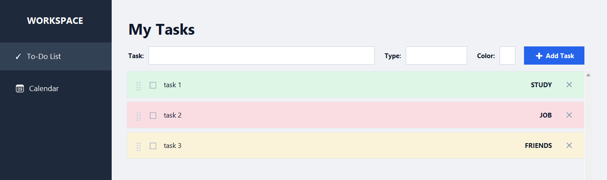
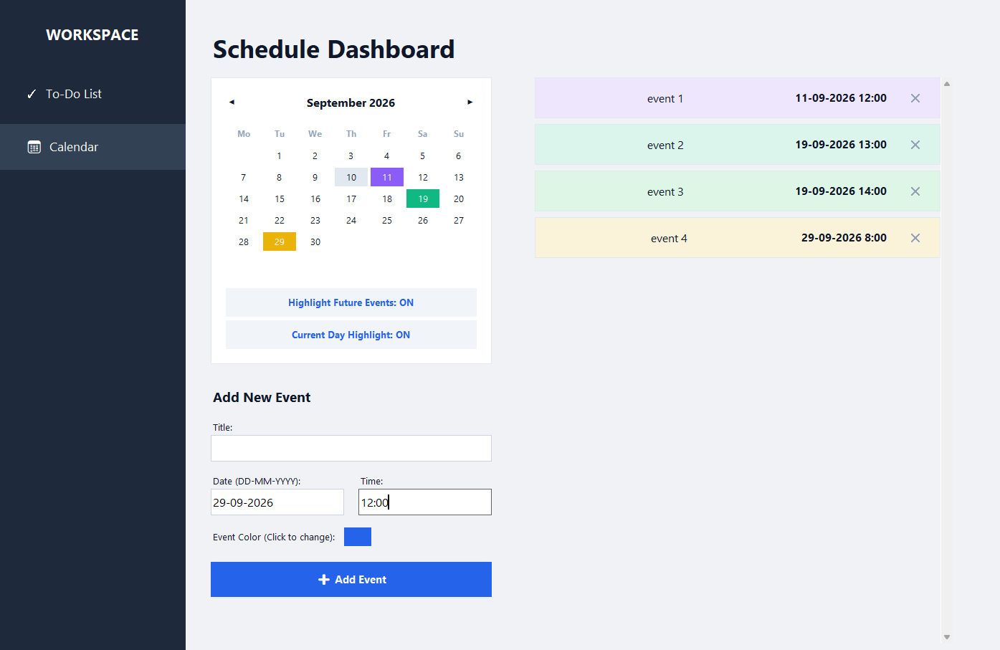

# Productivity & Schedule Tracker
[](https://creativecommons.org/licenses/by-nc/4.0/)

A desktop application built with Python and Tkinter for managing daily tasks and scheduling events. 





## Features
* **To-Do List:** Create, color-code, complete, and drag-and-drop tasks.
* **Calendar Dashboard:** Visual monthly calendar with day/event highlighting.
* **Event Management:** Schedule events with dates, times, and custom colors.
* **Smart Reminders:** Automatic pop-up alerts for next-day events.
* **Modern UI:** Clean, flat-design interface with a curated color palette.

## Usage
1. Clone or download this repository.
2. Run the application from your terminal:
   ```bash
   python app.py
   ```
   *(Note: Replace `app.py` with the actual name of your Python file).*

## Data Storage
All data is stored locally in a generated `tracker_data.json` file within the application directory. No internet connection, cloud syncing, or database setup is currently required.

## Implementation Methodology and AI Assistance

Python script generated with Gemini-pro 3.1. All code manually verfied in usage, all features and visual layout designed by me. 

## Repository Structure

```text
.
├── screenshots/        # Application screenshots
├── LICENCE             # License information
├── README.md           # Project documentation
├── app.py              # Main application code
└── tracker_data.json   # Local data storage file
```
